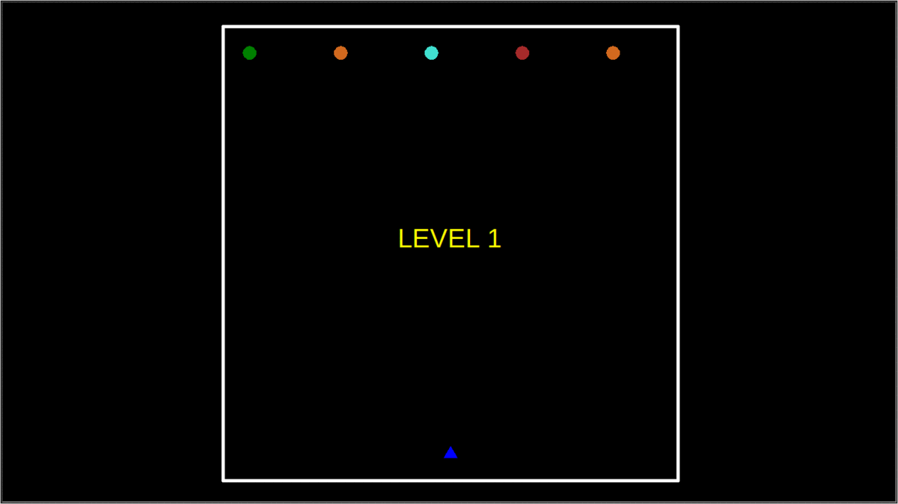

<h1 align="center">
	Space Invaders v1.0
</h1>

<h4 align="center">
	:hammer: Thiago Marinho Pereira
</h4>

<p align="center">


</p>

<p align="center">
	<a href="#rocket-technologies">Technologies</a>&nbsp;&nbsp;&nbsp;|&nbsp;&nbsp;&nbsp;
	<a href="#computer-project">Project</a>&nbsp;&nbsp;&nbsp;|&nbsp;&nbsp;&nbsp;
	<a href="#wrench-installation">Installation</a>&nbsp;&nbsp;&nbsp;|&nbsp;&nbsp;&nbsp;
	<a href="#memo-license">License</a>
</p>

<br>

<p align="center">
	
</p>

## :rocket: Technologies

This project was built using following technologies:

- [Python](https://www.python.org/)
- [Tkinter](https://docs.python.org/3/library/tkinter.html)
- [Turtle Graphics](https://docs.python.org/3/library/turtle.html)

## :computer: Project

*Space Invaders is a video game made by the Taito Corporation. Space Invaders is one of the most famous early video games. The game is about defending the Earth from Space Invaders (aliens) by shooting them down before they can land. There have been seven versions of Space Invaders made by the Taito Corporation. Space Invaders was designed by the Taito Corporations man in charge of the game making department, Toshihiro Nishikado. [[Simple Wikipedia](https://simple.wikipedia.org/wiki/Space_Invaders)]*

## :wrench: Installation

__You must install Tkinter and Turtle modules using the following commands on your Terminal:__

```bash
# Update packages (on Linux devices)
$ sudo apt update

# Python 3 version
$ sudo apt install python3-tk

# Or install Python older versions (it may cause incompatibility)
$ sudo apt install python-tk
```

__Execute the following command to run the game on your Terminal:__

```bash
$ make
```

## :memo: License

This project is under MIT License. Check out [LICENSE](LICENSE) file to more details.

---

<p align="center">
	Built with :hearts: by <a href="https://github.com/ThiagoPereiraUFV" target="_blank">Thiago Pereira</a>
</p>